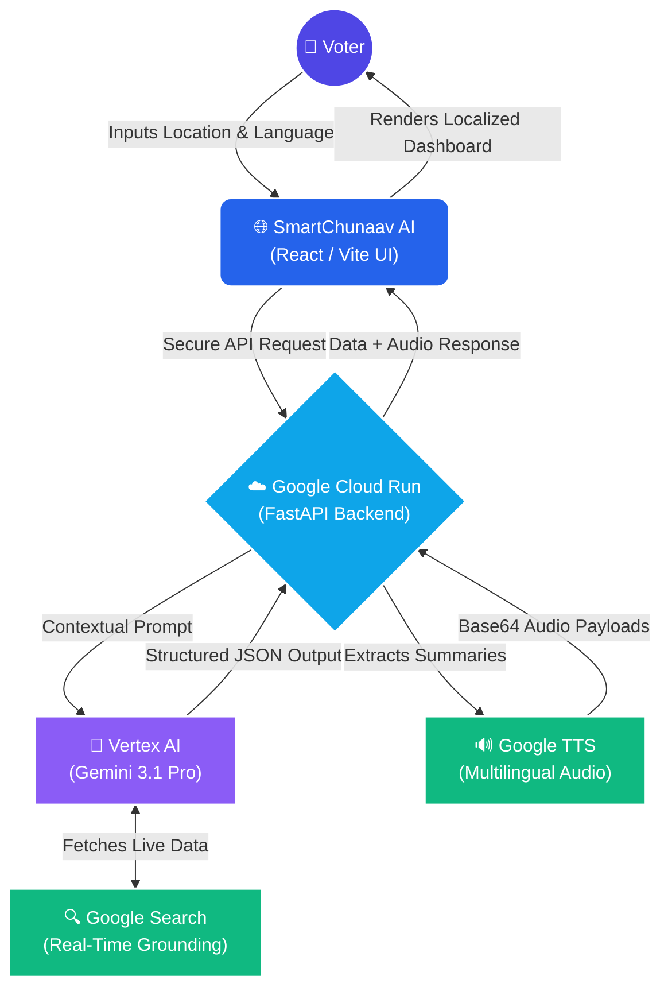

<div align="center">
  
  <h1>SmartChunaav AI 🌍</h1>
  <p><b>Your Non-Partisan, AI-Powered Electoral Guide</b></p>
  <p><i>Engineered for the Prompt Wars Hackathon by Hack2Skill using Google Antigravity</i></p>
  <br>
  <p><b>Lead AI Architect & Orchestrator:</b> Paaras Shemrudkar</p>
</div>

<br>

## 🎯 Problem Statement

Democratic participation relies on accessible, accurate, and hyper-local information. However, voters frequently face immense friction: fragmented polling data, language barriers, complex voting procedures, and outdated election timelines. 

The **SmartChunaav AI** eliminates this friction. It transforms raw, scattered civic data into a beautiful, personalized, and fully accessible dashboard, empowering citizens to make informed democratic decisions instantly.

## 📖 About the Project

**SmartChunaav AI** is a production-grade, hyper-local civic assistant. Powered by **Vertex AI's Gemini 3.1 Pro** and armed with **Google Search Grounding**, it acts as a real-time, non-partisan electoral analyst. 

The application automatically detects the user's geographic location and preferred language, generating a comprehensive dashboard featuring upcoming election timelines, step-by-step voting procedures, and a granular breakdown of the local and national political landscape.

🔗 **Live Production URL:** [https://election-navigator-526623014042.asia-south1.run.app](https://election-navigator-526623014042.asia-south1.run.app)

## 🛠️ Deployment Walkthrough (Google Cloud Run)

We successfully deployed the full-stack application to **Google Cloud Run** in the `asia-south1` region, ensuring optimal performance for the target demographic.

**Deployment Command:**
```bash
gcloud run deploy election-navigator \
  --source . \
  --region asia-south1 \
  --allow-unauthenticated \
  --port 8080 \
  --project=election-agent-h2s
```

## 🔄 Application Architecture Flow



**Infrastructure Highlights:**
* **Service URL:Cloud Run URL** [https://election-navigator-526623014042.asia-south1.run.app](https://election-navigator-526623014042.asia-south1.run.app)
* **Container Runtime:** Multi-stage Docker build serving the compiled React frontend statically via the FastAPI backend.
* **Authentication:** Public endpoint for universal access.
* **Region:** Asia South 1 (Mumbai) for low-latency delivery in India.

---

## 🏆 Evaluation Alignment: The X-Factors:-

This application was meticulously architected to exceed the evaluation criteria and the solve the problem to a great extent:

* **1. Accessibility (Our Biggest X-Factor):** We built an inclusive tool featuring **Instant 13-Language i18n** (translating complex AI data instantly into Hindi, Gujarati, Marathi, Tamil, etc.). Furthermore, we built a custom **"Triple-Audio" Engine** using Google TTS, generating native, high-fidelity audio briefings for visually impaired voters.
* **2. Security (Zero-Trust Architecture):** API keys are strictly hidden within the FastAPI backend environment. The React frontend uses secure, relative API routing (`/api/...`), ensuring Vertex AI keys are never exposed to the client browser. The FastAPI backend is fortified with strict CORS Middleware handling to prevent unauthorized cross-origin resource sharing.
* **3. Efficiency (Scalable Cloud Run):** We engineered a multi-stage Docker build. The React frontend is compiled and served statically via the FastAPI backend, allowing the entire full-stack application to run on a single, lightweight, highly efficient Google Cloud Run container.
* **4. Testing & Reliability:** Implemented robust asynchronous error handling, graceful fallbacks for geolocation denials, and rigorous JSON Schema enforcement to prevent LLM hallucination crashes.Integrated Automated CI/CD Pipelines via GitHub Actions and extensive Pytest Unit Testing to ensure zero regressions during deployment.
* **5. Code Quality:** Decoupled frontend/backend architecture, componentized React structure, and modular Python routing ensures clean, readable, and highly maintainable code.

## 🌐 Google Tech Stack Deep Dive

This project is a love letter to the Google Cloud and AI ecosystem, deeply integrating multiple services to create a seamless user experience:

1. **Vertex AI (Gemini 3.1 Pro):** Acts as the core reasoning engine. It processes the user's hyper-local context and synthesizes complex political landscapes into structured, unbiased JSON data.
2. **Google Search Tool (Grounding):** Bypasses traditional LLM training cutoffs. The agent actively searches the web to return up-to-the-minute political leadership, candidate portfolios, and exact election dates.
3. **Google Text-to-Speech (gTTS):** Natively integrated into the Python backend to generate Base64 audio payloads, bypassing unreliable browser-based speech APIs for uniform, high-fidelity multilingual audio.
4. **Google Cloud Run:** Deployed in the `asia-south1` (Mumbai) region for ultra-low latency, utilizing Google's enterprise-grade secure infrastructure and IAM policy binding for Service Account authentication.
5. **Google Antigravity:** Utilized exclusively as the primary IDE and agentic orchestration tool for full-stack development and debugging.
6. **Google Analytics:** Integrated gtag.js for real-time user telemetry and traffic analysis.


## 🧠 Approach, Logic & Assumptions

**Chosen Vertical:** Smart Civic / Democratic Assistant.

**The Logic & Architecture:**
The application utilizes a decoupled, secure architecture. The React frontend handles user context (Geolocation + Language) and passes it securely to a FastAPI backend. The backend constructs a highly constrained prompt and enforces a strict `Schema` object. This forces the Vertex AI Gemini model to return a structured JSON response containing arrays for timelines, steps, and political candidates, ensuring the frontend renders complex data flawlessly every time without parsing errors.

**Assumptions Made:**
1. The user grants browser location permissions for optimal hyper-local data (graceful fallbacks exist if denied).
2. The user has an active internet connection to stream the generated `gTTS` base64 audio payloads.
3. The platform assumes a neutral, non-partisan stance, actively prompting the AI to provide unbiased 2-sentence background portfolios for political candidates.

## 💻 The Tech Stack

| Category | Technology | Purpose |
| :--- | :--- | :--- |
| **Frontend UI** | React + Vite + Tailwind CSS v4 | Blazing fast, responsive, glass-morphic UI with native Dark Mode. |
| **Backend API** | FastAPI (Python) | High-performance asynchronous backend routing and schema validation. |
| **AI Brain** | Vertex AI (Gemini 3.1 Pro) | Core intelligence and multilingual synthesis engine. |
| **Real-Time Data** | Google Search Tool | Eliminates hallucinations by retrieving live electoral data. |
| **Accessibility** | Google TTS (`gTTS`) | Generates native audio summaries for visually impaired users. |
| **Cloud Hosting** | Google Cloud Run | Multi-stage Docker container deployed for scalable, zero-latency access. |

## ⚙️ Local Installation
```bash
# 1. Clone the repository
git clone [YOUR_GITHUB_REPO_URL]

# 2. Setup the Python Backend
cd backend
pip install -r requirements.txt
uvicorn main:app --reload

# 3. Setup the React Frontend
cd ../frontend
npm install
npm run dev